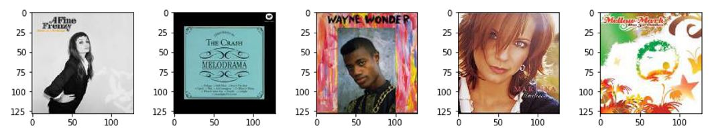
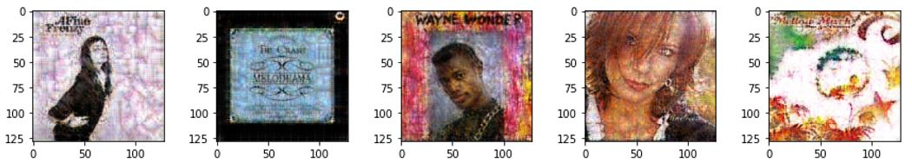
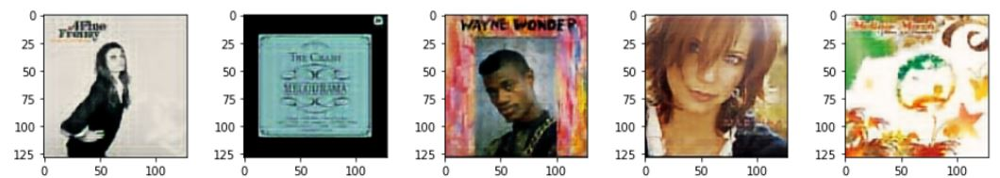

# Towards_album_artwork_generation_based_on_audio

In this github repository I leave all experiments and analysis on my thesis "Towards album artwork generation based on audio", see on https://drive.google.com/file/d/1scFpsCY6XIzlZHmDzzWI2GryafkLyglI/view?usp=sharing

## Abstract
Music albums nowadays, can not be conceived without its artwork. Since first used, album
artwork importance has changed. In our digital era, audiovisual content is everywhere
and of course, regarding music albums, album covers play an important role. Computer
Vision has unleashed powerful technologies for image generation,in the last decade, which
have been used for lots of different applications. In particular, the main discoveries are
Varational Autoencoders (VAEs) and Generative Adversarial Networks (GANs). Latest
researches on these technologies have contributed to understand and improve them, ac-
quiring high quality and complex image generation. In this thesis, we experiment with the
latest image generation tools to achieve album artwork generation based on audio sam-
ples. We first analyse image generation without audio conditioning for VAEs and the three
GAN approaches: vanilla GAN, Least Squares GAN (LSGAN) and Wasserter GAN with
gradient penalty (WGAN-GP). Finally, we try the best model, from these experiment but
with audio conditioning. Despite being able to generate new album covers without audio
conditioning, we do not achieve the final objective of album cover generation based on
audio. We manually discuss, which state of the art tools could be reviewed and implemented
for this project.

Keywords: Generative models, Generative Adversarial Networks (GAN), Image generation,
Album cover

## Archives
* dataset:
* gans:
* 

## Contents
In this README we show the different contents and experiments you can find in the repository:

1. Dataset. We provide a multimodal dataset prepocessed and gathered for this specific task.
1. Preliminary experiments:  
    1. Image reconstruction techiniques analysis
    1. Album artwork generation
1. Album artwork generation based on audio

## Dataset
To study album cover generation based on audio features we need:
* Album cover images
* Audio features
* Metadata with the music genre

We gather two different datasets from MSD-I dataset from Oramas et al [[1]](#1) and AcousticBrainz (which contains metadata and audio features from AllMusic, Discogs,
Lastfm and Tagtraum) together with https://github.com/lastfm/coverartarchive-api to download the related album covers for each of the samples:
* Covers-only dataset

-|nº     
-|-
Unique covers | 36,126
Total covers  | 50,084
 
 
 * Audio and Covers dataset
 
-|nº     
-|-
Total covers | 119,592
Total audio  | 119,592
Unique covers | 50,084

You can download dataset from the link: https://drive.google.com/file/d/1lmqfxOLMEnBajFtq_r5xMQpEap1AEu43/view?usp=sharing

#### Specifications:
* Both dataset have three splits: train, val and test. Each of the splits has 16 folder for each of the different music genres. Inside of each of the music genre folders 3 name types can be found: 
    * Tracks that are only in musicbrainz. String format: musicbrainz_releasetrackid + '\__' + musicbrainz_albumartistid Ex) e52a5405-eec0-4f2a-9f3c-0f800e1164e3-0__478ff859-34eb-457e-b9d2-dc74b5a372e9.npy
    * Tracks that are only in MSD-I. Format: MSD-I_id Ex) TRGGZMN12903CB9D8C.npy
    * Tracks that are in both datasets. Format: MSD-I_id + '\_\__' +  musicbrainz_releasetrackid + '\_\__' + musicbrainz_albumartistid Ex) TRGOLLE128F14B187C__4d32b2a3-4096-4806-820b-17271b2b9f1b-0__b8f5d59e-4463-45b0-9b96-aac54ad7b327.npy

* Album covers are in .jpg format, have a 128x128 resolution and 8 bit depth.
* Audio features are in .npy format. Each sample has a size of 1160.

* More info about preprocessing steps can be found in the document. In dataset folder there are two files:
    * utils.py: utils functions used in the dataset during the implementation of the thesis.
    * main.java: function used with https://github.com/lastfm/coverartarchive-api to download album covers.

## Preliminary experiments
### Image reconstruction techniques
We analize two AE architectures based on:
1. Convolutional layers in the decoder
1. Upsampling, padding and convolutional layers in the decoder

####Results
Original images from test set:

Output images from AE with transpose convolutional layers decoder:

Output images from AE with upsampling, padding and convolutional layers in the decoder:

## References
<a id="1">[1]</a> 
S. Oramas, F. Barbieri, O. Nieto, and X. Serra, \Multimodal Deep Learning for Music
Genre Classication," Transactions of the International Society for Music Information
Retrieval, vol. 1, no. 1, pp. 4{21, sep 2018, [Online] Available: http://transactions.
ismir.net/articles/10.5334/tismir.10/. Accessed on August 31, 2020.

